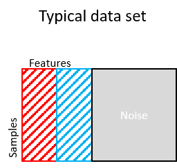

```{r, echo = FALSE, message=F}
library(knitr)
library(mclust)
library(kableExtra)
library(magrittr)
library(doParallel)

source("MOSAIC.R")
knitr::opts_chunk$set(collapse=TRUE, fig.retina=2, fig.path = "README_figures/README-")
```

## Installation

MOSAIC or **M**ulti-**O**mics **S**upervised **I**ntegrative **C**lustering is available on request, once it is out of developmental phase. 


## Introduction

_MOSAIC_ is a multi-omic supervised clustering algorithm led by outcome of interest. This methodology is inspired from _survClust[1]_
, which is an outcome weighted supervised clustering algorithm, designed to classify patients according to their molecular as well as time-event or end point of interest data.

Here we aim to explore population classification according to outcome. For example, categorical response to immunotherapy - Response (Complete Response/Partial Response) vs Progressed, High Risk vs Low Risk, Stage etc.

## Simulation Example

Let's simulate a data set with 3-class structure, correlating 3 categories of interest. We will simulate a competing 3-class structure to demonstrate the advantage of our methodology over unsupervised clustering. MOSAIC outputs cross-validated solution to avoid over-fitting.  

```{r}

set.seed(112)
n1 = 50 #class1
n2 = 50 #class2
n3 = 50 #class3
n = n1+n2+n3
p = 15 #outcome related features (10%)
q = 120 #noise

#class1 ~ N(1.5,1), class2 ~ N(0,1), class3 ~ N(-1.5,1)

rnames = paste0("S",1:n)
x = NULL
x1a = matrix(rnorm(n1*p, 1.5, 1), ncol=p)
x2a = matrix(rnorm(n1*p), ncol=p)
x3a = matrix(rnorm(n1*p, -1.5,1), ncol=p)
xa = rbind(x1a,x2a,x3a)
xb = matrix(rnorm(n*q), ncol=q)
x[[1]] = cbind(xa,xb)


################
# sample 15 other informant features, but scramble them.

permute.idx<-sample(1:length(rnames),length(rnames))
x1a = matrix(rnorm(n1*p, 1.5, 1), ncol=p)
x2a = matrix(rnorm(n1*p), ncol=p)
x3a = matrix(rnorm(n1*p, -1.5,1), ncol=p)
xa = rbind(x1a,x2a,x3a)

x[[1]] = cbind(x[[1]],xa[permute.idx,])
rownames(x[[1]]) =  rnames

#true class labels
truth = c(rep(1,50), rep(2,50), rep(3,50)); names(truth) = rnames
mat = x

```

See below, a figure explaining the simulation structure, where some features (red) are related to outcome of interest and are molecularly distinct, some unrelated to outcome yet distinct (blue) and remaining are noise (grey)   



We wish to find an underlying signature of features that will describe the outcome categories of interest. A 3-fold cross validation for k=2 to 7 was performed by MOSAIC, for 10 randomly sampled simulated datasets. 

```{r, echo=FALSE}

registerDoParallel(cores=6)
cvrounds<-function(x,out,kk){
    this.fold=3
    fit<-list()
    for (i in 1:10){
        fit[[i]] = cv.survclust(mat, out,kk,this.fold)
        
    }
    print(paste0("finished ", this.fold, " rounds for k= ", kk))
    return(fit)
}

ptm <- proc.time()
cv.fit<-foreach(kk=2:7) %dopar% cvrounds(mat,truth,kk)
```

We will asses cross validated solutions over two metrics - adjustedRandIndex and Standardized Pooled Within Sum of Square Statistic (SPWSS). 

```{r, fig.height=5, fig.width=10, echo=FALSE}

spwss = adjR = matrix(NA, nrow=10, ncol=6)

for(i in 1:length(cv.fit)){
  tt = cv.fit[[i]]
  spwss[,i] = unlist(lapply(tt, function(x) x$cv.ss))
  adjR[,i] = unlist(lapply(tt, function(x) adjustedRandIndex(x$cv.labels, truth[names(x$cv.labels)])))
  
}

par(mfrow=c(1,2))
par(bty="l")
boxplot(spwss, names=2:7, col="coral", ylab="SPWSS", xlab="K clusters", main= "SPWSS",border="coral")

boxplot(adjR, names=2:7, col="purple", ylab="adj RI", xlab="K clusters", main= "Adjusted Rand Index",border="purple")

```

We see how Adjusted Rand Index is maximized at **k=3** and Standardized Pooled Within Sum of Square Statistic (SPWSS) is elbow-ed at k=3 as well. 

```{r}

solnk3 = cv.voting(cv.fit, getDist(mat,truth),3)
kable(table(solnk3, truth[names(solnk3)]), row.names = T, "html", caption = "MOSAIC 3-class vs simulated truth")

```

Wheras, if we performed unsupervised clustering - 

```{r}

mat.dd =as.matrix(dist(mat[[1]], method="euclidean"))
cmd.mat = cmdscale(mat.dd, k=nrow(mat.dd)-1)
unsup.k3 = kmeans(cmd.mat,3, nstart = 100)
kable(table(unsup.k3$cluster, truth[names(solnk3)]), row.names=T, type="html", caption = "unsupervised clustering vs simulated truth")
```