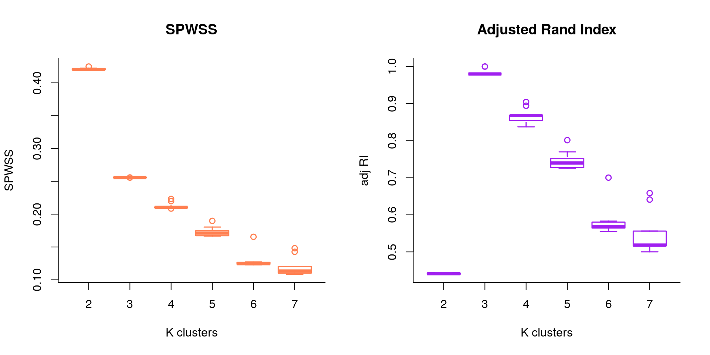

MOSAIC
================

## Installation

MOSAIC or **M**ulti-**O**mics **S**upervised **I**ntegrative
**C**lustering is available on request, once it is out of developmental
phase.

## Introduction

*MOSAIC* is a multi-omic supervised clustering algorithm led by outcome
of interest. This methodology is inspired from *survClust\[1\]* , which
is an outcome weighted supervised clustering algorithm, designed to
classify patients according to their molecular as well as time-event or
end point of interest data.

Here we aim to explore population classification according to outcome.
For example, categorical response to immunotherapy - Response (Complete
Response/Partial Response) vs Progressed, High Risk vs Low Risk, Stage
etc.

## Simulation Example

Let’s simulate a data set with 3-class structure, correlating 3
categories of interest. We will simulate a competing 3-class structure
to demonstrate the advantage of our methodology over unsupervised
clustering. MOSAIC outputs cross-validated solution to avoid
over-fitting.

``` r

set.seed(112)
n1 = 50 #class1
n2 = 50 #class2
n3 = 50 #class3
n = n1+n2+n3
p = 15 #outcome related features (10%)
q = 120 #noise

#class1 ~ N(1.5,1), class2 ~ N(0,1), class3 ~ N(-1.5,1)

rnames = paste0("S",1:n)
x = NULL
x1a = matrix(rnorm(n1*p, 1.5, 1), ncol=p)
x2a = matrix(rnorm(n1*p), ncol=p)
x3a = matrix(rnorm(n1*p, -1.5,1), ncol=p)
xa = rbind(x1a,x2a,x3a)
xb = matrix(rnorm(n*q), ncol=q)
x[[1]] = cbind(xa,xb)


################
# sample 15 other informant features, but scramble them.

permute.idx<-sample(1:length(rnames),length(rnames))
x1a = matrix(rnorm(n1*p, 1.5, 1), ncol=p)
x2a = matrix(rnorm(n1*p), ncol=p)
x3a = matrix(rnorm(n1*p, -1.5,1), ncol=p)
xa = rbind(x1a,x2a,x3a)

x[[1]] = cbind(x[[1]],xa[permute.idx,])
rownames(x[[1]]) =  rnames

#true class labels
truth = c(rep(1,50), rep(2,50), rep(3,50)); names(truth) = rnames
mat = x
```

See below, a figure explaining the simulation structure, where some
features (red) are related to outcome of interest and are molecularly
distinct, some unrelated to outcome yet distinct (blue) and remaining
are noise (grey)


We wish to find an underlying signature of features that will describe
the outcome categories of interest. A 3-fold cross validation for k=2 to
7 was performed by MOSAIC, for 10 randomly sampled simulated datasets.

We will asses cross validated solutions over two metrics -
adjustedRandIndex and Standardized Pooled Within Sum of Square Statistic
(SPWSS).



We see how Adjusted Rand Index is maximized at **k=3** and Standardized
Pooled Within Sum of Square Statistic (SPWSS) is elbow-ed at k=3 as
well.

``` r

solnk3 = cv.voting(cv.fit, getDist(mat,truth),3)
## performing consensus on 10 rounds
kable(table(solnk3, truth[names(solnk3)]), row.names = T, "html", caption = "MOSAIC 3-class vs simulated truth")
```

<table>

<caption>

MOSAIC 3-class vs simulated truth

</caption>

<thead>

<tr>

<th style="text-align:left;">

</th>

<th style="text-align:right;">

1

</th>

<th style="text-align:right;">

2

</th>

<th style="text-align:right;">

3

</th>

</tr>

</thead>

<tbody>

<tr>

<td style="text-align:left;">

1

</td>

<td style="text-align:right;">

0

</td>

<td style="text-align:right;">

49

</td>

<td style="text-align:right;">

0

</td>

</tr>

<tr>

<td style="text-align:left;">

2

</td>

<td style="text-align:right;">

0

</td>

<td style="text-align:right;">

1

</td>

<td style="text-align:right;">

50

</td>

</tr>

<tr>

<td style="text-align:left;">

3

</td>

<td style="text-align:right;">

50

</td>

<td style="text-align:right;">

0

</td>

<td style="text-align:right;">

0

</td>

</tr>

</tbody>

</table>

Wheras, if we performed unsupervised clustering -

``` r

mat.dd =as.matrix(dist(mat[[1]], method="euclidean"))
cmd.mat = cmdscale(mat.dd, k=nrow(mat.dd)-1)
unsup.k3 = kmeans(cmd.mat,3, nstart = 100)
kable(table(unsup.k3$cluster, truth[names(solnk3)]), row.names=T, type="html", caption = "unsupervised clustering vs simulated truth")
```

<table>

<caption>

unsupervised clustering vs simulated truth

</caption>

<thead>

<tr>

<th style="text-align:left;">

</th>

<th style="text-align:right;">

1

</th>

<th style="text-align:right;">

2

</th>

<th style="text-align:right;">

3

</th>

</tr>

</thead>

<tbody>

<tr>

<td style="text-align:left;">

1

</td>

<td style="text-align:right;">

0

</td>

<td style="text-align:right;">

6

</td>

<td style="text-align:right;">

34

</td>

</tr>

<tr>

<td style="text-align:left;">

2

</td>

<td style="text-align:right;">

15

</td>

<td style="text-align:right;">

24

</td>

<td style="text-align:right;">

16

</td>

</tr>

<tr>

<td style="text-align:left;">

3

</td>

<td style="text-align:right;">

35

</td>

<td style="text-align:right;">

20

</td>

<td style="text-align:right;">

0

</td>

</tr>

</tbody>

</table>
